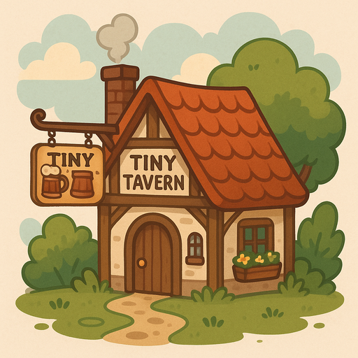
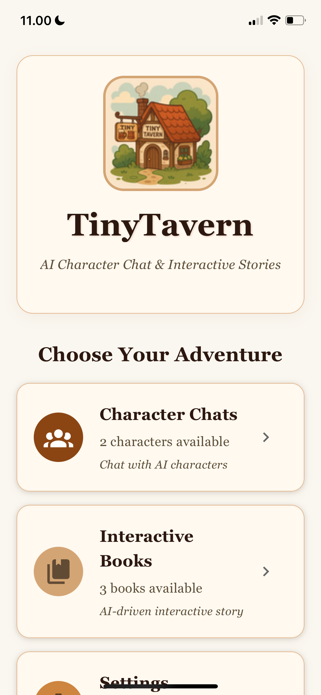
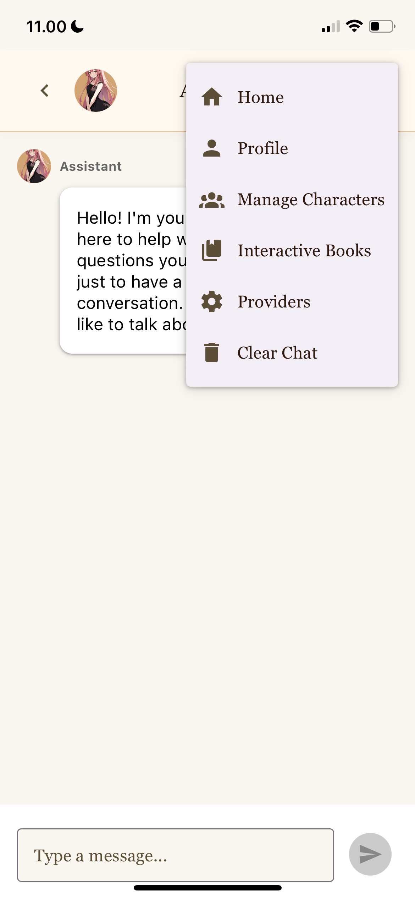
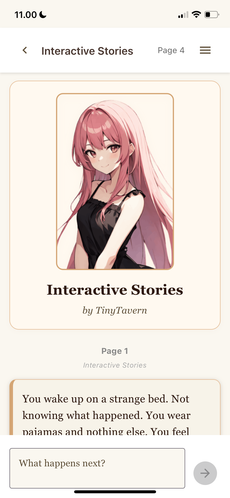
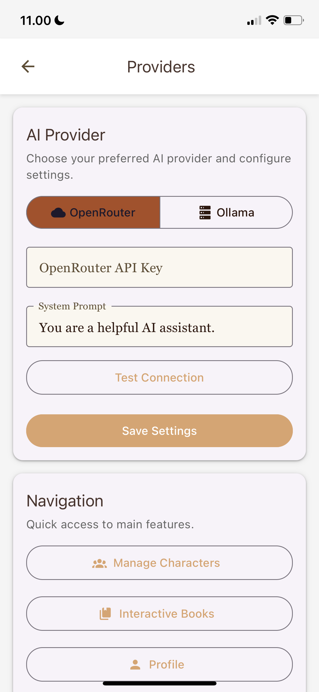

<div align="center">
  
</div>

# TinyTavern - AI Character Chat

A free and open-source AI character chat application for mobile devices, designed as a portable version of SillyTavern. Create, customize, and chat with AI characters using your preferred LLM provider.

I like the idea of chat with my SillyTavern characters on the go. Connect into my self hosted Ollama server or OpenRouter API.

I vibe code this app in a few hours, so it is not really well polished. Not also published into app store/play store yet. But you can compile or try on your device using Expo Go app. Enjoy.

## Screenshots

<div align="center">
  
  
  
  
</div>

_Character selection, character details, character editing, and provider settings screens_

## Features

- 🤖 **AI Character Chat**: Engage in conversations with customizable AI characters
- 📱 **Cross-Platform**: Available for iOS, Android, and Web
- 🎭 **Character Management**: Create, import, and manage AI characters
- 🔄 **Character Card Support**: Import/export Character Card v2 and v3 formats (PNG)
- 🏷️ **Search & Filter**: Find characters by name and filter by tags
- 💬 **Per-Character Chat History**: Separate conversation history for each character
- 🌐 **Multiple LLM Providers**: Support for OpenRouter and Ollama
- 🆓 **Completely Free**: No subscriptions, no hidden costs
- 🔓 **Open Source**: MIT licensed

## Getting Started

### Prerequisites

- Node.js (v14 or higher)
- npm or yarn
- Expo CLI (for mobile development)

### Installation

1. **Clone the repository**

   ```bash
   git clone https://github.com/yourusername/tinytavern.git
   cd tinytavern
   ```

2. **Install dependencies**

   ```bash
   npm install
   ```

3. **Run the application**

   **For Web:**

   ```bash
   npm run web
   ```

   **For Mobile (Development):**

   ```bash
   npx expo start -c --tunnel
   ```

   Then scan the QR code with Expo Go app on your phone.

   **For Production Build:**

   ```bash
   npx expo prebuild
   # Follow platform-specific build instructions
   ```

## Configuration

### Setting up LLM Providers

#### OpenRouter

1. Register at [OpenRouter](https://openrouter.ai/)
2. Get your API key from the dashboard
3. In the app, go to Settings → Add your API key
4. Choose from 60+ free models available

#### Ollama

1. Install [Ollama](https://ollama.ai/) on your local machine
2. Run Ollama server: `ollama serve`
3. In the app, configure Ollama host and port (default: localhost:11434)
4. Pull desired models: `ollama pull model-name`

## Character Management

### Importing Characters

1. **From Character Card websites:**

   - Visit sites like [Character Tavern](https://character-tavern.com/)
   - Download character cards as PNG files
   - Import them using the upload button in the Characters screen

2. **From SillyTavern:**
   - Export your existing characters as PNG files from SillyTavern
   - Import them directly into TinyTavern

### Creating Characters

Create custom AI characters with:

- Name and description
- Personality traits
- Scenario/background
- First message
- Custom avatar
- Tags for organization

## App Structure

```
src/
├── screens/           # Application screens
├── services/          # API and storage services
├── utils/            # Utility functions
├── types/            # TypeScript type definitions
└── components/       # Reusable components
```

## Key Features Explained

### Character Cards

TinyTavern supports both Character Card v2 and v3 formats, ensuring compatibility with popular character sharing platforms and SillyTavern exports.

### Chat History Separation

Each character maintains its own conversation history, allowing you to have ongoing conversations with multiple characters without mixing contexts.

### Search and Filtering

Quickly find characters using the search bar or filter by tags. Characters can be organized with custom tags for better management.

## Contributing

We welcome contributions! Please feel free to submit issues, feature requests, or pull requests.

1. Fork the repository
2. Create your feature branch (`git checkout -b feature/amazing-feature`)
3. Commit your changes (`git commit -m 'Add some amazing feature'`)
4. Push to the branch (`git push origin feature/amazing-feature`)
5. Open a Pull Request

## License

This project is licensed under the MIT License - see the [LICENSE](LICENSE) file for details.

## Support

If you encounter any issues or have questions:

- Open an issue on GitHub
- Check existing issues for solutions
- Contribute to the documentation

## Why TinyTavern?

While there are many paid "AI girlfriend" or "AI boyfriend" apps available, TinyTavern provides:

- **Complete freedom** - No subscription fees or hidden costs
- **Privacy** - Your data stays with you
- **Customization** - Full control over your AI characters
- **Compatibility** - Works with existing character cards and formats
- **Transparency** - Open source code you can trust

---

**TinyTavern** - Your personal AI companion, completely free and open source.
