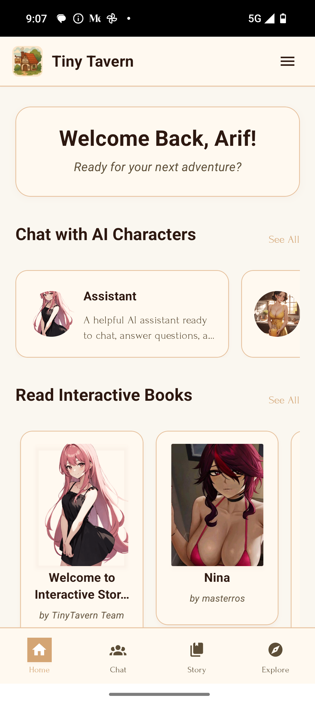
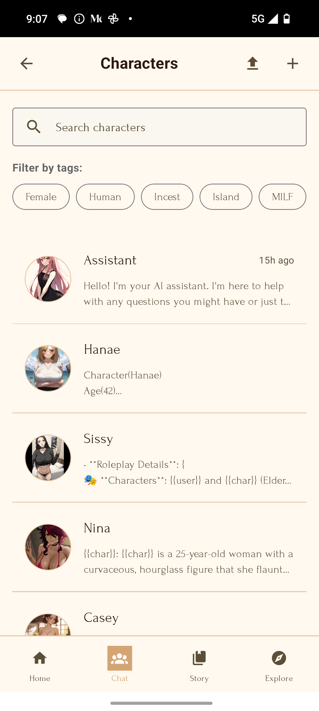
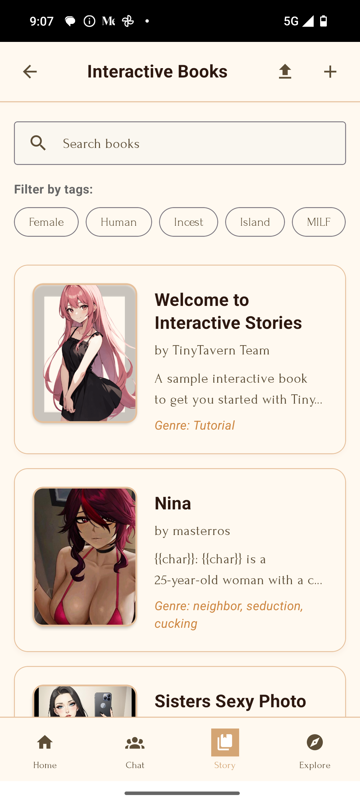
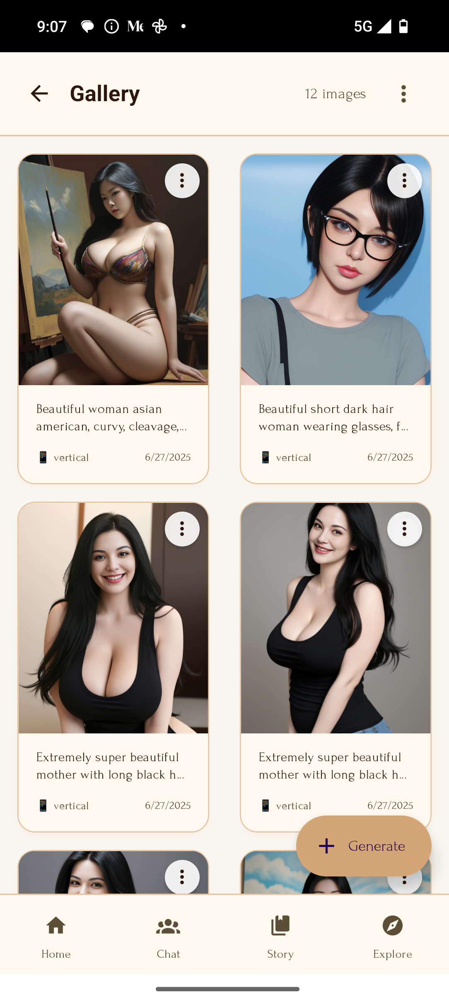

<div align="center">
  
</div>

# TinyTavern - AI Character Chat & Interactive Stories

A free and open-source AI character chat and interactive storytelling application for mobile devices. Chat with AI characters and experience immersive interactive books powered by your preferred LLM provider.

Experience the magic of AI-powered conversations and interactive storytelling on your mobile device. Chat with your favorite SillyTavern characters and dive into choose-your-own-adventure style books where every decision shapes the story.

Connect to your self-hosted Ollama server or use OpenRouter API for the ultimate portable AI experience.

## Screenshots

<div align="center">
  
  
  
  
</div>

_Character selection, character details, character editing, and provider settings screens_

## Features

### 🤖 AI Character Chat

- Engage in conversations with customizable AI characters
- Character Card v2/v3 support (PNG import/export)
- Per-character conversation history
- Variable replacement system ({{char}}, {{user}})
- Search and filter characters by name and tags

### 📚 Interactive Books

- AI-powered choose-your-own-adventure stories
- Convert character cards into interactive books
- Page-style reading interface with book covers
- Template variables for personalized storytelling
- Story continuation based on your choices
- **AI-generated illustrations** to enhance storytelling experience
- Insert custom artwork during story progression

### 🎨 AI Image Generation Gallery

- Generate images using AI with customizable prompts
- Support for landscape and portrait orientations
- Local storage and gallery management
- Download images to device photo gallery
- Configurable image generation service (Stable Diffusion WebUI API compatible)
- Integration with story illustrations in interactive books

### 🛠️ Technical Features

- **Cross-Platform**: iOS, Android, and Web support
- **Multiple LLM Providers**: OpenRouter and Ollama integration
- **AI Image Generation**: Stable Diffusion WebUI API compatible services
- **Beautiful UI**: Book-inspired theme with serif fonts and warm colors
- **Profile System**: Personalized experience with user profiles
- **Data Management**: Local storage with AsyncStorage
- **Media Library Integration**: Save generated images to device gallery

### 🆓 Open & Free

- Completely free with no subscriptions
- Open source (MIT licensed)
- No data collection or tracking
- Self-hosted option available

## Getting Started

### Prerequisites

- Node.js (v14 or higher)
- npm or yarn
- Expo CLI (for mobile development)

### Installation

1. **Clone the repository**

   ```bash
   git clone https://github.com/yourusername/tinytavern.git
   cd tinytavern
   ```

2. **Install dependencies**

   ```bash
   npm install
   ```

3. **Run the application**

   **For Web:**

   ```bash
   npm run web
   ```

   **For Mobile (Development):**

   ```bash
   npx expo start -c --tunnel
   ```

   Then scan the QR code with Expo Go app on your phone.

   **For Production Build:**

   ```bash
   npx expo prebuild
   # Follow platform-specific build instructions
   ```

## Configuration

### Setting up LLM Providers

#### OpenRouter

1. Register at [OpenRouter](https://openrouter.ai/)
2. Get your API key from the dashboard
3. In the app, go to Settings → LLM Provider → Add your API key
4. Choose from 60+ free models available

#### Ollama

1. Install [Ollama](https://ollama.ai/) on your local machine or server
2. Run Ollama server: `ollama serve`
3. In the app, configure Ollama host (e.g., `localhost` or `https://your-domain.com`)
4. Set port only if needed (leave empty for HTTPS domains)
5. Pull desired models: `ollama pull model-name`

**Note**: For cloud deployments, just enter your domain (like `https://ollama.yourdomain.com`) and leave the port field empty.

### Setting up AI Image Generation

#### Compatible Services

The app works with any service that has a `/txt2img` endpoint compatible with Stable Diffusion WebUI API:

1. **Novita AI**: Professional cloud service
   - Base URL: `https://api.novita.ai/v3/async`
   - Requires API key authorization
2. **Self-hosted Stable Diffusion WebUI**:

   - Base URL: `http://localhost:7860/sdapi/v1`
   - No authorization required by default

3. **Custom Services**: Any API compatible with SD WebUI format

#### Configuration Steps

1. Go to Settings → Image Provider
2. Enter your base URL (without `/txt2img`)
3. Set port if needed (leave empty for HTTPS)
4. Add authorization key if required
5. Test connection to verify setup
6. Use Gallery feature to generate images

## Character Management

### Importing Characters

1. **From Character Card websites:**

   - Visit sites like [Character Tavern](https://character-tavern.com/)
   - Download character cards as PNG files
   - Import them using the upload button in the Characters screen

2. **From SillyTavern:**

   - Export your existing characters as PNG files from SillyTavern
   - Import them directly into TinyTavern

3. **Dual Purpose Import:**
   - Character cards can be imported as characters OR interactive books
   - Same PNG files work for both features

### Creating Characters

Create custom AI characters with:

- Name and description
- Personality traits
- Scenario/background
- First message (supports {{char}} and {{user}} variables)
- Custom avatar
- Tags for organization

## Interactive Books

### Creating Books

1. **Manual Creation:**

   - Create books from scratch with title, author, genre
   - Write opening scenarios and first pages
   - Add book covers and descriptions

2. **From Character Cards:**
   - Import any character card PNG as an interactive book
   - Character data automatically converts to book format:
     - Character name → Book title
     - Creator → Author
     - First message → First page
     - Scenario → Book setting

### Book Features

- **Variable System**: Use {{user}}, {{char}}, {{book}}, {{author}} in your content
- **Page-Style Interface**: Reading experience mimics real books
- **Choice-Driven**: Your decisions shape the story progression
- **Book Covers**: Visual covers enhance the reading experience
- **Persistent Progress**: Each book maintains its own story progression
- **AI Illustrations**: Generate and insert custom artwork during story progression
- **Smart Suggestions**: AI analyzes story content to suggest relevant illustrations

## App Structure

```
src/
├── screens/           # Application screens
│   ├── HomeScreen.tsx           # Main landing page
│   ├── ChatScreen.tsx           # Character conversations
│   ├── BookChatScreen.tsx       # Interactive book reading
│   ├── GalleryScreen.tsx        # AI image gallery
│   ├── ImageGenerationScreen.tsx # AI image creation
│   ├── CharacterManagementScreen.tsx
│   ├── BookManagementScreen.tsx
│   └── SettingsScreen.tsx       # Provider configuration
├── services/          # API and storage services
│   ├── characterCard.ts         # Character card processing
│   ├── bookStorage.ts          # Book data management
│   ├── imageStorage.ts         # Image gallery management
│   ├── imageGeneration.ts      # AI image generation API
│   ├── openrouter.ts           # OpenRouter API
│   └── ollama.ts               # Ollama API
├── utils/            # Utility functions
│   ├── variableReplacement.ts  # Template variables
│   └── storage.ts              # AsyncStorage wrapper
├── types/            # TypeScript type definitions
├── styles/           # Theme and styling
│   └── theme.ts               # Book-inspired theme
└── components/       # Reusable components
    ├── ImageViewerModal.tsx    # Full-screen image viewer
    └── IllustrationGenerationModal.tsx # Story illustration creator
```

## Key Features Explained

### Character Cards & Dual-Purpose Import

TinyTavern supports Character Card v2 and v3 formats with a unique twist - the same PNG character card can be imported as either:

- **Character**: For traditional AI conversations
- **Interactive Book**: For story-driven experiences

This innovative approach means your existing character collection doubles as a library of interactive stories.

### Variable Replacement System

Both characters and books support template variables:

- `{{char}}` - Character/protagonist name
- `{{user}}` - Reader's name
- `{{book}}` - Book title (books only)
- `{{author}}` - Author name (books only)

### Separate Data Management

- **Characters**: Individual chat histories per character
- **Books**: Story progression tracking with choice history
- **Profile System**: User preferences enhance personalization

### Beautiful Book Theme

The app features a carefully designed book-inspired interface:

- Warm amber color palette
- Serif typography for readability
- Page-style layouts for books
- Elegant shadows and borders

## Contributing

We welcome contributions! Please feel free to submit issues, feature requests, or pull requests.

1. Fork the repository
2. Create your feature branch (`git checkout -b feature/amazing-feature`)
3. Commit your changes (`git commit -m 'Add some amazing feature'`)
4. Push to the branch (`git push origin feature/amazing-feature`)
5. Open a Pull Request

## License

This project is licensed under the MIT License - see the [LICENSE](LICENSE) file for details.

## Support

If you encounter any issues or have questions:

- Open an issue on GitHub
- Check existing issues for solutions
- Contribute to the documentation

## Why TinyTavern?

While there are many paid AI chat apps available, TinyTavern offers something unique:

### 💝 For Character Chat Enthusiasts

- **Complete freedom** - No subscription fees or hidden costs
- **Privacy first** - Your data stays with you
- **Full compatibility** - Works with existing SillyTavern characters
- **Unlimited conversations** - No message limits or restrictions

### 📖 For Interactive Story Lovers

- **Innovative dual-purpose** - Turn character cards into interactive books
- **AI-powered storytelling** - Every choice creates unique narratives
- **Portable reading** - Take your stories anywhere
- **Community driven** - Share and discover new interactive experiences

### 🔓 For Everyone

- **Open source transparency** - Code you can trust and modify
- **Cross-platform** - Works on all devices
- **Self-hostable** - Complete control over your AI infrastructure
- **No vendor lock-in** - Your data, your choice

---

**TinyTavern** - Your personal AI companion and interactive storyteller, completely free and open source.
